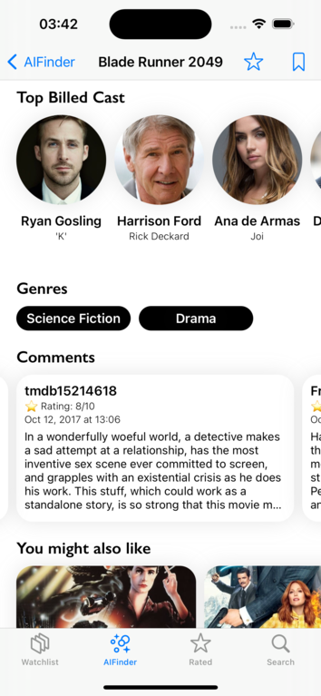

# VibeMovieFinder

**VibeMovieFinder** is an innovative iOS application designed to transform how you discover movies. By generating unique "vibes," the app helps you find films that perfectly match your current mood or interests. Whether you're craving a nostalgic teen comedy, a thrilling cyberpunk adventure, or an award-winning drama, VibeMovieFinder has you covered. The app also lets you manage your watchlist, rate movies, and explore detailed information about each film, all powered by seamless integrations with Google AI and The Movie Database (TMDb) API.

## Key Features

- **Vibe-Based Movie Recommendations:** Discover movies tailored to specific vibes, such as Cyberpunk, A24, Sci-Fi Indie, and more. Using advanced AI, VibeMovieFinder curates personalized recommendations that exclude films you've already seen, ensuring fresh and exciting options every time.

- **Comprehensive Movie Details:** Access rich movie information by The Movie Database (TMDB), including plot summaries, cast lists, community ratings, imeages, genres, recommendations etc. Dive deep into the world of each film and make informed viewing choices.

- **Watchlist Management:** Keep track of movies you want to watch and manage your watchlist effortlessly within the app.

- **Community-Driven Ratings:** Contribute to the TMDb community by rating movies after watching them. Your ratings help shape the overall movie scores visible across the app, adding value to the global film community.

## Screenshots


*Movies suggested by AI based on selected vibes. This screen shows a list of films that match the chosen mood or theme.*


*Movie details screen showcasing backdrops, movie facts, images, and an overview of the film.*


*Detailed view of a movie featuring the Top Billed Cast, Genres, and additional movie recommendations.*


*Configurator for selecting vibes such as Sci-Fi, Western, Oscar, Mountain, and more, to tailor your movie recommendations.*


*Manage your watchlist with ease. This screen shows all the movies you’ve marked to watch later.*


*View the list of movies you’ve rated. This helps you keep track of your personal ratings and reviews.*


*Search for movies easily with the built-in search feature. Find movies by title, genre, or other criteria.*


## Technologies Used

- **MVVM Architecture:** The app follows the Model-View-ViewModel architecture, ensuring a clear separation of concerns and making the codebase easy to maintain and extend.

- **OOP & SOLID Principles:** The app is built using Object-Oriented Programming and adheres to SOLID principles, making the code robust, scalable, and easy to understand.

- **Design Patterns:** Design patterns, including Singleton, Observer, Factory, etc are utilized to enhance code organization and maintainability.

- **UIKit:** The user interface is crafted using UIKit, providing a polished and intuitive experience.

- **REST API Integration:** The app integrates with Google AI for generating movie vibes and with The Movie Database (TMDb) API for fetching detailed movie data.

- **Swift Concurrency & GCD:** Swift Concurrency and Grand Central Dispatch (GCD) are used to handle asynchronous operations smoothly, keeping the user interface responsive.

## Getting Started

1. **Clone the Repository:**
   ```bash
   git clone https://github.com/denibondarenkq/VibeMovieFinder
   ```
2. **Install Dependencies:**
   Open the project in Xcode and ensure all dependencies are installed.

3. **Create and Configure `Secrets.plist`:**
   - Create a file named `Secrets.plist` in the root of your project.
   - Add the following content to `Secrets.plist`, replacing the placeholder keys with your actual API keys:

     ```xml
     <?xml version="1.0" encoding="UTF-8"?>
     <!DOCTYPE plist PUBLIC "-//Apple//DTD PLIST 1.0//EN" "http://www.apple.com/DTDs/PropertyList-1.0.dtd">
     <plist version="1.0">
     <dict>
       <key>GeminiAPIKey</key>
       <string>Your_Gemini_API_Key_Here</string>
       <key>TMDBBearerToken</key>
       <string>Your_TMDB_Bearer_Token_Here</string>
     </dict>
     </plist>
     ```

   - Replace `Your_Gemini_API_Key_Here` and `Your_TMDB_Bearer_Token_Here` with your actual API keys.

4. **Build and Run:**
   Build and run the project on your iOS device or simulator to start discovering movies based on your mood!

## Contribution

We welcome contributions! Feel free to fork the repository, make improvements, and submit a pull request.

## License

This project is licensed under the MIT License. See the `LICENSE` file for more details.

---

**VibeMovieFinder**: Where your mood meets its perfect movie match.
